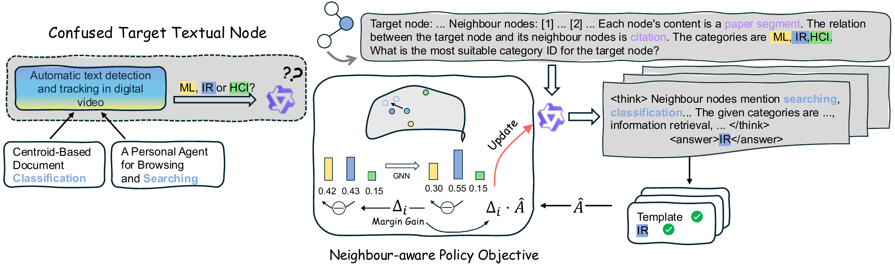

# TRN-R1-Zero

**Text-rich Network Reasoning via LLMs with Reinforcement Learning Only**
*Yilun Liu, Ruihong Qiu, Zi Huang*  ·  ACL 2026

[](https://arxiv.org/abs/2604.19070)
[](https://huggingface.co/Allen-UQ/trn-r1-zero-7b)
[](https://huggingface.co/datasets/Allen-UQ/trn-r1-zero-tags)
[](LICENSE)

<p align="center">
  
</p>

TRN-R1-Zero is a **post-training framework for text-rich network (TRN) reasoning
trained solely via reinforcement learning**. It directly optimises a base LLM with
a *Neighbour-aware Group Relative Policy Optimisation* objective that dynamically
adjusts rewards based on a novel **margin gain** metric for the informativeness
of neighbouring signals, guiding the model toward relational reasoning. Unlike
prior methods, TRN-R1-Zero requires no supervised fine-tuning or chain-of-thought
data distilled from large reasoning models. Trained strictly at the node level,
it further achieves zero-shot inference on edge- and graph-level tasks.

---

## Setup

1. Install **verl** by following the
   [official installation guide](https://verl.readthedocs.io/en/latest/start/install.html).
2. Install the two extras not pulled by verl —
   `torch-geometric` (SGC-based margin-gain reward) and `openai` (vLLM eval client):
   ```bash
   pip install -r requirements.txt
   ```

---

## Datasets

We release the six cleaned text-rich network TAGs used in the paper —
`citeseer`, `history`, `cora`, `wikics`, `instagram`, `photo` — as a single
HuggingFace dataset,
[`Allen-UQ/trn-r1-zero-tags`](https://huggingface.co/datasets/Allen-UQ/trn-r1-zero-tags).
`citeseer` and `history` are used for training; `cora`, `wikics`, `instagram`,
`photo` are held-out for zero-shot evaluation. Download them once into
`datasets/tags/`; both training and inference build their prompt sets from this
directory.

```bash
huggingface-cli download Allen-UQ/trn-r1-zero-tags \
    --repo-type dataset --local-dir datasets/tags
```

After this, `datasets/tags/` contains `citeseer.pt`, `history.pt`, `cora.pt`,
`wikics.pt`, `instagram.pt`, and `photo.pt`.

---

## Training

Training nodes: `citeseer`, `history`.  In-loop evaluation: `citeseer`, `cora`.

```bash
# 1) Build training and evaluation prompts (margin-gain hardness baked in)
TAG_ROOT=datasets/tags bash scripts/train/build_train_prompts.sh
TAG_ROOT=datasets/tags bash scripts/eval/build_prompts.sh

# 2) Merge prompt DatasetDicts into verl-friendly parquet
TRAIN_DATASETS="datasets/prompts/citeseer_train_nei3_prompts datasets/prompts/history_train_nei3_prompts" \
TEST_DATASETS="datasets/prompts/citeseer_eval_nei3_prompts datasets/prompts/cora_eval_nei3_prompts" \
OUT_DIR=verl_data/run \
bash scripts/train/prepare_data.sh

# 3) GRPO training with the neighbour-aware margin-gain reward
MODEL_NAME=Qwen/Qwen2.5-7B-Instruct \
REWARD=margin \
VERL_OUT_DIR=verl_data/run \
NUM_GPUS=4 \
bash scripts/train/train.sh
```

Common knobs (batch size, rollout `n`, LR, GPU memory utilisation, …) are
exposed as env vars at the top of `scripts/train/train.sh`.

---

## Inference

`eval.sh` boots a vLLM OpenAI-compatible server on port 21000 and runs an
async client over every dataset; per-split accuracy, macro-F1, and
hallucination-rate are written to `results/eval/<dataset>/<split>/`.

If you skipped Training, build the eval prompts first:

```bash
TAG_ROOT=datasets/tags bash scripts/eval/build_prompts.sh
```

Run inference with the released 7B checkpoint
[`Allen-UQ/trn-r1-zero-7b`](https://huggingface.co/Allen-UQ/trn-r1-zero-7b):

```bash
MODEL_NAME=Allen-UQ/trn-r1-zero-7b \
DATASETS="datasets/prompts/cora_eval_nei3_prompts \
          datasets/prompts/wikics_eval_nei3_prompts \
          datasets/prompts/instagram_eval_nei3_prompts \
          datasets/prompts/photo_eval_nei3_prompts" \
bash scripts/eval/eval.sh
```

To evaluate a checkpoint you trained yourself, first merge the verl FSDP
checkpoint into a HuggingFace model directory using verl's built-in merger,
then point `MODEL_NAME` at it:

```bash
python3 -m verl.model_merger merge \
    --backend fsdp \
    --local_dir  checkpoints/nc-r1-margin/<experiment_name>/global_step_<N>/actor \
    --target_dir merged_models/run

MODEL_NAME=./merged_models/run \
DATASETS="datasets/prompts/cora_eval_nei3_prompts datasets/prompts/wikics_eval_nei3_prompts \
          datasets/prompts/instagram_eval_nei3_prompts datasets/prompts/photo_eval_nei3_prompts" \
bash scripts/eval/eval.sh
```

---

## Citation

```bibtex
@inproceedings{liu2026trnr1zero,
  title     = {{TRN-R1-Zero: Text-rich Network Reasoning via LLMs with Reinforcement Learning Only}},
  author    = {Liu, Yilun and Qiu, Ruihong and Huang, Zi},
  booktitle = {Proceedings of the 64th Annual Meeting of the Association for Computational Linguistics (ACL)},
  year      = {2026}
}
```

## License

MIT — see [LICENSE](LICENSE).
